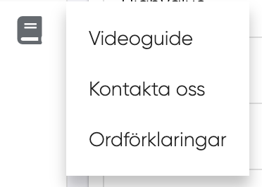
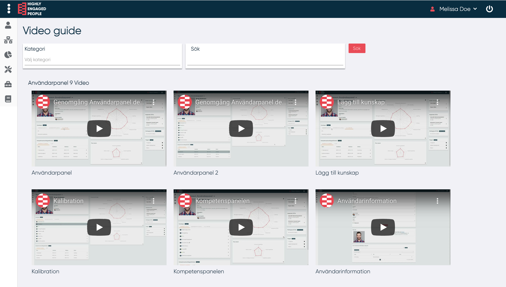
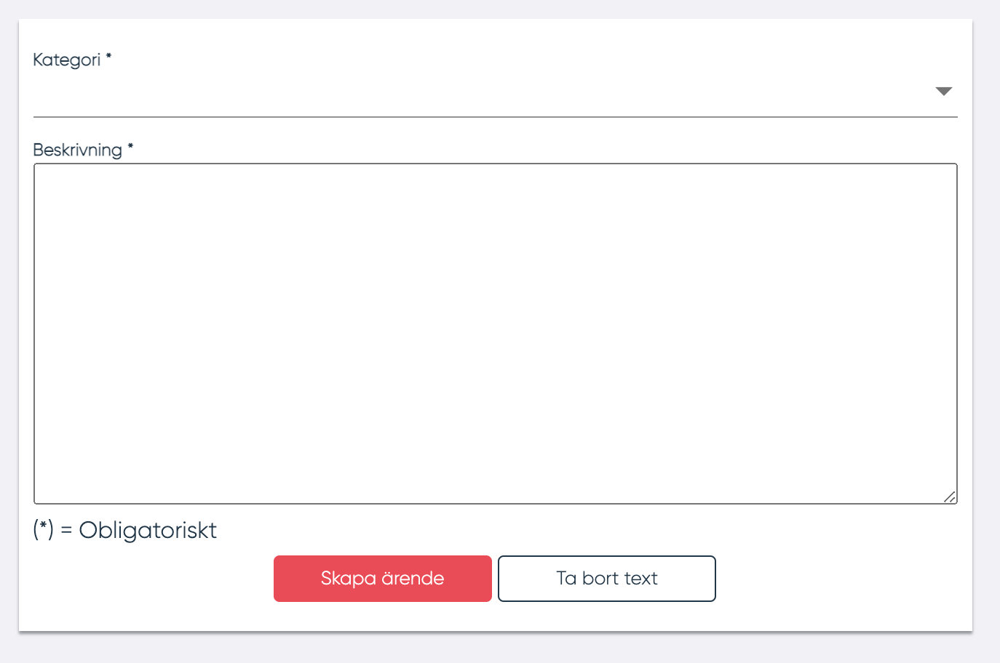
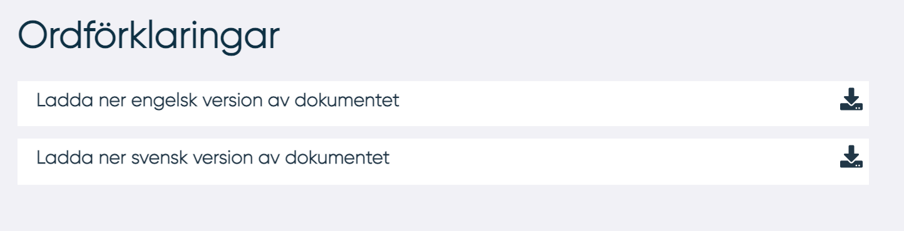

# Användarsupport

HEP erbjuder olika typer av support för användaren. Användarsupport hittas i menyn under boksymbolen:

<figure markdown>

</figure>

## Videoguide

**HEP** tillhandahåller videoguider för att visa hur man genomför en rad av olika uppgifter. Användaren kan söka efter kategori eller beskrivning. För att söka skriver användaren in den sökta kategorin eller beskrivningen i textfältet och trycker på "Sök"-knappen.

{width=800}

## Kontakta oss

Om användaren önskar ytterligare hjälp utöver videoguides kan ett ärende öppnas för att kontakta **HEP**. Ett ärende öppnas genom att fylla i formuläret under "Kontakta Oss".
Ett meddelande och ett e-postmeddelande informerar användaren om att ärendet har skapats.

## Ordlista med ordförklaringar

I verktyget kommer många termer att nämnas. En ordlista finns att hämta under "Ordförklaringar"

------------------
