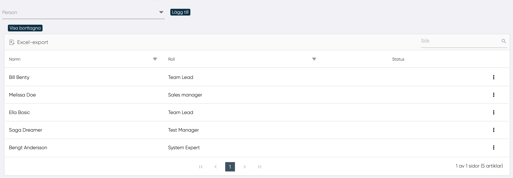

# Administration av Kompetensguide

Med den här funktionen kan användaren definiera vilken person som kan väljas av MP som kompetensguide.

HR kan i rullgardinsmeny lägga till och ta bort användare som kan vara kompetensguider. Genom att välja en person i listan och klicka på "Lägg till" kan HR göra det möjligt för en användare att vara kompetensguide. De användare som kan vara kompetensguide visas i en tabell. En kompetensguiden kan tas bort genom att välja "Ta bort" i rullgardinsmenyn för den valda kompetensguiden.

HR kan välja att visa borttagna kompetensguider genom att trycka på "Visa borttagna".

I tabellen visas:

- Namn
- Roll
- Status (borttagen eller aktuell)

I rullgardinsmenyn kan HR välja att ta bort och återaktivera en borttagen kompetensguide.

---------------
