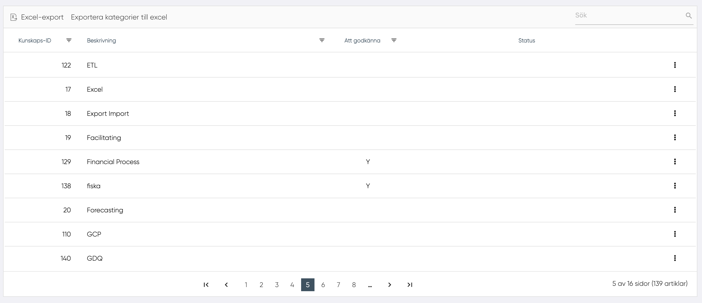

# Administration av kunskaper

Den här funktionen gör det möjligt för HR att se alla kunskap som finns för en organisation.
I tabellen visas:

- Kunskaps-ID
- Beskrivning eller namn på kunskapen
- Om en kunskap måste verifieras eller godkännas visas ett "Y" under rubriken "Att godkänna". Detta gäller för kunskaper som användare har lagt till och där HR kan välja att godkänna dessa som kunskaper som ska finnas i organisationen.
- Status, indikeras om kunskapen är borttagen

## Uppdatera

Genom att klicka på "Uppdatera" i menyn vid kunskapen visas ett popup-fönster.
I det här fönstret finns listan över alla kunskaper som finns för organisationen. Genom att klicka på "Byt ut med denna kunskap" vid en kunskap i listan kan HR ersätta den valda kunskapen med en annan kunskap som finns i listan.

## Ta bort

Genom att klicka på "Ta bort" tas kunskapen bort från listan över kunsaper som är valbara i organisationen.

## Återaktivera

Genom att klicka på "Återaktivera" görs kunskapen åter tillgänglig att välja.

-------------------
