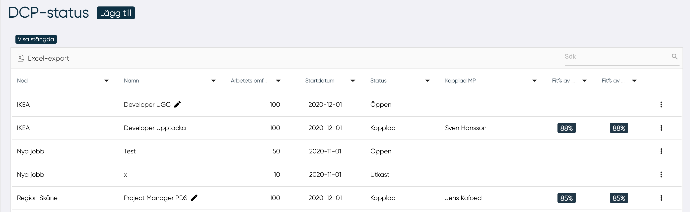
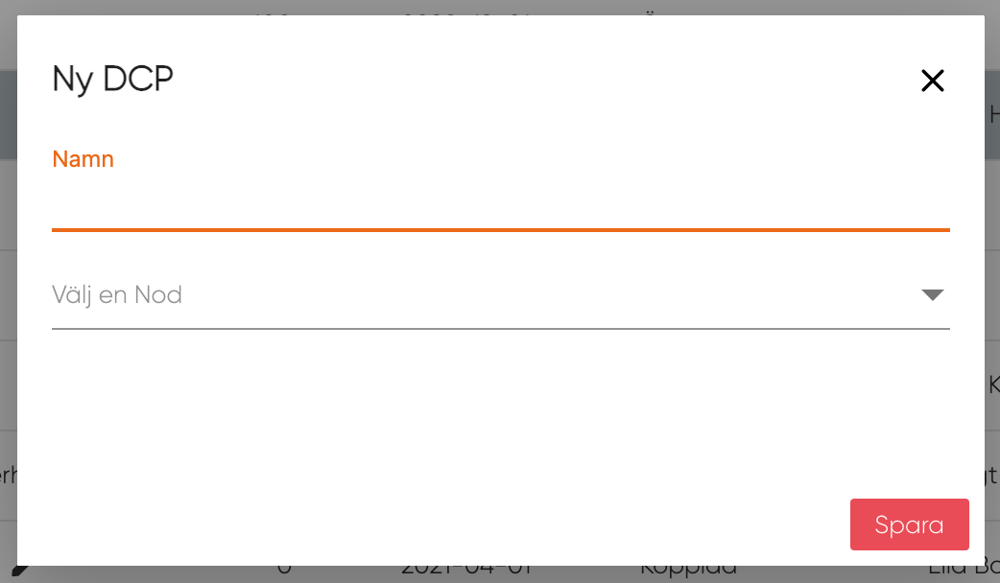

# DCP status

Ledaren kan på DCP-status sidan hantera DCPer, det vill säga, redigera, skapa nya och ta bort dem för alla moder där den är ledare.

Genom att klicka på knappen "Lägg till" kan användaren skapa en ny DCP.

I tabellen visas följande data:

- Nod
- Namn på DCP
- Arbetets omfattning
- Startdatum
- Status
- Kopplad MP
- Fit-gap avssende på alla kärnkunskaper i DCPn
- Fit-gap avseende de kunskaper som finns i MPns profil

## Skapa ny DCP

<figure markdown>
{width=500}
</figure>
Genom att klicka på knappen "Lägg till" öppnas ett popup-fönster och ledaren kan skriva in all information som behövs för att definiera nästa DCP:

- Namn på DCP
- Den nod som DCPn ska tillhöra

Efter detta kommer en ny sida upp med den nya DCP:n, för mer information: [Klicka här](ny_dcp.md){ .md-button .md-button--primary}

------------
