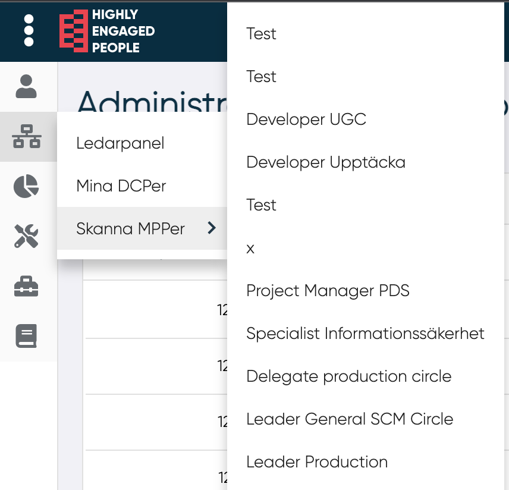
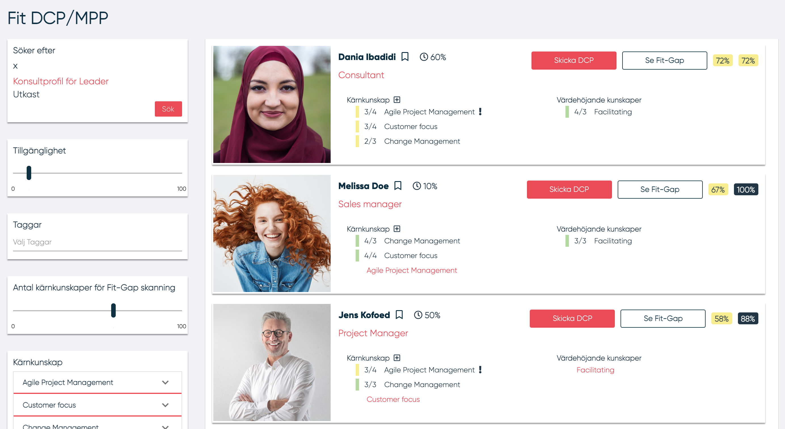

# Skanna MPPer

<!---Mindre bild--->

Det finns två sätt att skanna efter MPPer för en specifik DCP:

1. Genom att klicka på "Skanna MPPer" och sedan välja en önskad DCP visas formuläret på en ny flik.

2. Genom att i panelen DCP-status välja "Skanna MPPer" i rullgardinsmenyn för den valda DCPn.
<!---bild--->

När användaren har valt att skanna MPPer så omdiregeras den till denna sida.

DCP-data och filterparametrar finns till vänster.
Användaren kan filtrera efter:

- Tillgänglighet för MPer som ska synas i listan
- Taggar
- Antal kärnkunskaper för fit-gap
- Kärnkunskaper och värdeskapande kunskaper
- Om sökningen endast ska visa MPPer som har intresse för en specielt kunskap
- Om sökningen endast ska visa MPPer som vill lära sig en specifik kunskap

MPPs som passar sökkriterier listas till höger. MPPs listas sorterade efter procent fit-gap avseende kärnkunskaper.

För varje MP visas följande information:

- Namn
- Tillgänglighet
- Roll
- Kärnkunskaper och värdeskapande kunskaper
- Fit-gap avseende DCP-kunskaper
- Fit-gap avseende de kunskaper som MP har i sin profil

Genom att klicka på "Skicka DCP" kan ledaren skicka DCPn till MP som kan komplettera sin profil och bekräfta eller ej om den är intresserad av DCPn. Ett e-postmeddelande skickas till MP för att informera denna om att den har fått en DCP.
Genom att klicka på knappen "Se fit-gap" öppnas fit-gap-vyn i en ny flik.

--------------

Genom att klicka på "Se fit-gap" öppnas en flik med den kompletta fit-gap analysen. 

<!---Bild--->

Här kan ledaren se:

- Fit-gap avseende alla kunskaper i DCPn, visas i procent
- Fit-gap avseende de kunskaper som MP har i sin profil, visas i procent
- Generell information om MP. Här kan användaren också koppla eller koppla bort MP från DCP. Detta genom att klicka på "Koppla till DCP" / "Koppla från DCP"
- Se MPs fullständiga kunskapsprofil, detta genom att klicka på ikonen symboliserad av en person.
- Se vilka taggar en MP har angett, detta genom att klicka på ikonen symboliserad av en hashtag.
- Jämförelse mellan kunskapsnivåerna för en MPP och DCP, detta både för kärnkunskaper och värdeskapande kunskaper
- Fit-gap analys avseende DCPns kompetensegenskaper och MPns förmågeprofil. MPP förmågeprofil är endast synlig om MP har valt att visa sin förmågeprofil för ledaren. Ledaren kan växla mellan att se ett spindeldiagram och en lista genom att klicka på ikonen i det nedre hörnet i panelen.
