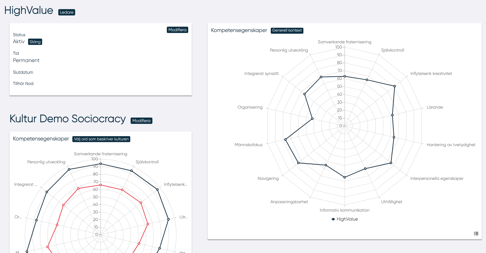

# Redigera nod

## Ledare

Genom att klicka på knappen "Ledare" öppnas en pop-up där det är möjligt att lägga till och ta bort ledare för noden.
Ledaren kan inte ta bort sig själv som ledare.

## Kultur

Genom att klicka på knappen "Välj ord som beskriver kulturen" kan ledaren välja 20 ord som symboliserar kulturen för den organisation som noden tillhör. Systemet beräknar sedan en kompetensegenskapsprofil med minimum- och maximumvärden inom vilka en MP bör ligga för att trivas att arbeta i organisationen.

<!---kanske inte borde stå varning på engelska--->
!!! warning
    Genom att ändra kulturparametrarna kommer den tidigare kompetensegenskapsprofil avseende kultur att raderas.

## Kompetensegenskaper

Genom att klicka "Generell kontext" kan en ledare skapa en kompetensegenskapsprofil för noden. I en pop-up kan ledaren:

- Beskriva organisationens geografiska spridning
- Till vilken grad regler och lagar styr arbetet i organisationen
- Storleken på organisationen
- Vilken typ av kulturell identitet som symboliserar organisationen
- Organisationens finansiella stabilitet
- Vilken grad av förandringar som ske i organisationen
- Vilken typ av organisatorisk modell (till exempel strikt hierarkiskt eller självorganiserat)
- Marknadens grad av rörlighet där organisationen verkar

Systemet räknar sedan fram en kompetensegenskapsprofil avseende nodens generella kontext.

--------------------------
