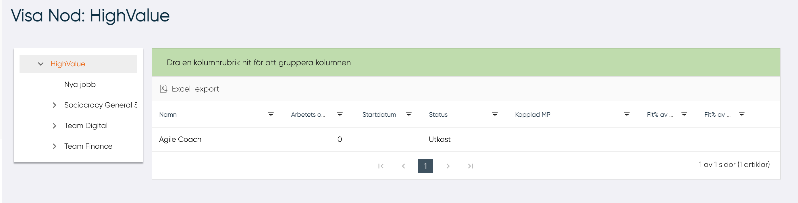

# Visa nod

Till vänster om tabellen visas den valda noden och alla dess undernoder.
Till höger finns listan över DCPer som är anslutna till noden. För varje DCP visas:

- Namnet på DCPn
- Arbetets omfattning i procent
- Startdatum
- Status
- Kopplad MP
- Fit-gap avseende alla kärnkunskaper som krävs för DCP
- Fit-gap avseende endast de kunskaper som MP har angett i sin profil

Om användaren klickar på de tre prickarna vid DCPn så kan användaren välja att öppna en komplett fit-gap analys

-------------------------------------------
