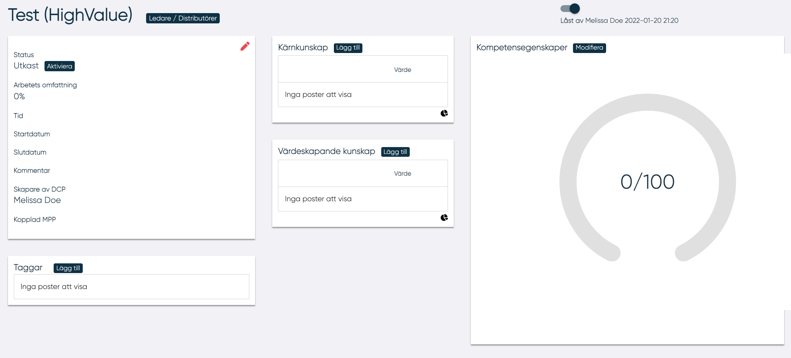
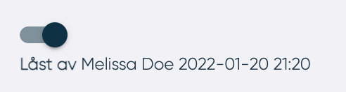

# Ny DCP

För att se hur man skapar en ny DCP se [DCP status](DCP-status.md){ .md-button .md-button--primary}

<!---Ny bild utan 0--->

Efter att ha skapat en ny DCP öppnas en sida med informationen:

- Allmän information om DCPn
- Taggar
- De kärnkunskaper som behövs för att utföra arbetsuppgifterna
- Kunskaper som adderar värde för att utföra arbetsuppgifterna
- En profil för de kompetensegenskaper som en användare bör ha för att trivas med arbetsuppgifterna

För att kunna redigera en DCP behöver man låsa den, detta görs ovanför DCPn:

Genom att trycka på knappen ledare/distributör är det möjligt att:

- Se vilka som är ledare och distributörer för DCPn
- Lägga till en nya ledare eller distributörer
- Ta bort ledare eller distributörer

Distributören kan inte redigera en DCP.
Användare kan inte ta bort sig själv som ledare.

## Data

Genom att trycka på den röda pennan i det övre hörnet på informationspanelen kan användaren lägga in allmän information avseende DCPn.

Har kan användaren kan infoga/ändra:

- Namn
- Beskrivning
- Arbetets omfattning i procent
- Typ (permanent eller tillfällig)
- Startdatum
- Slutdatum (endast för tillfälligt)
- Kommentar

## Taggar

Genom att klicka på "Lägg till" kan ledaren lägga till en ny tagg. Genom att klicka på ikonen som symboliseras av en soptunna kan ledaren ta bort en tagg.

## Kunskaper

I denna panel visas DCPs kärn- och värdehöjande kunskaper.

Genom att klicka på knappen "Lägg till" öppnas ett popup-fönster där man kan lägga till en kunskap.
Ledare måste välja en kunskap och kompetensnivå.
I rullgardinsmeny finns följande alternativ:

- Ändra kunskap, vilket gör det möjligt att ändra kunskapsnivå
- Ta bort vilket gör det möjligt att ta bort kunskapen från DCPn

## Kompetensegenskaper

I spindeldiagrammet visas de 14 kompetensegenskaper som en MP bör ha för att trivas med att utföra arbetsuppgifterna.

För att växla mellan spindeldiagram och lista klickar man på ikonen i nedre högra hörnet.

När listan visas är det möjligt att se en beskrivning av kompetensegenskaperna  kan man klicka på symbolen 'i'.

Genom att klicka på knappen 'Ändra' kan ledaren ändra kompetensegenskaperna.  

Genom att använda ”slidern” kan ledaren konfigurera kompetensegenskaperna för en DCP. Genom att flytta "slidern" till höger eller vänster kan ange till vilken grad de olika parameter överensstämmer med arbetsuppgiften.

För att generera kompetensegenskaperna måste alla parametrar ha ett värde.

Om inte alla parametrar är konfigurerade visas till vilken andel i procent som har konfigurerats.

-----------------
