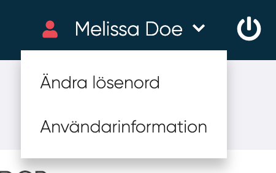
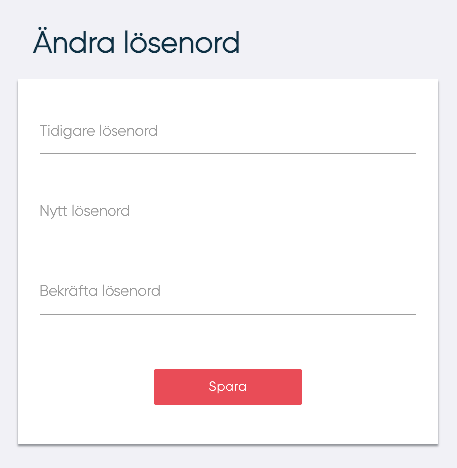

# Ändra lösenord

- För att ändra lösenord, navigera till och tryck på "Ändra lösenord"

<figure markdown>
{width=250}
</figure>

- Fyll i nuvarande lösenord och sen det önskade lösenordet två gånger och tryck på "Spara".
Det nya lösenordet måste följa kriterier som definierats av din organisation, annars visas ett förklarande felmedelande.

<figure markdown>
{width=300}
</figure>

---------
