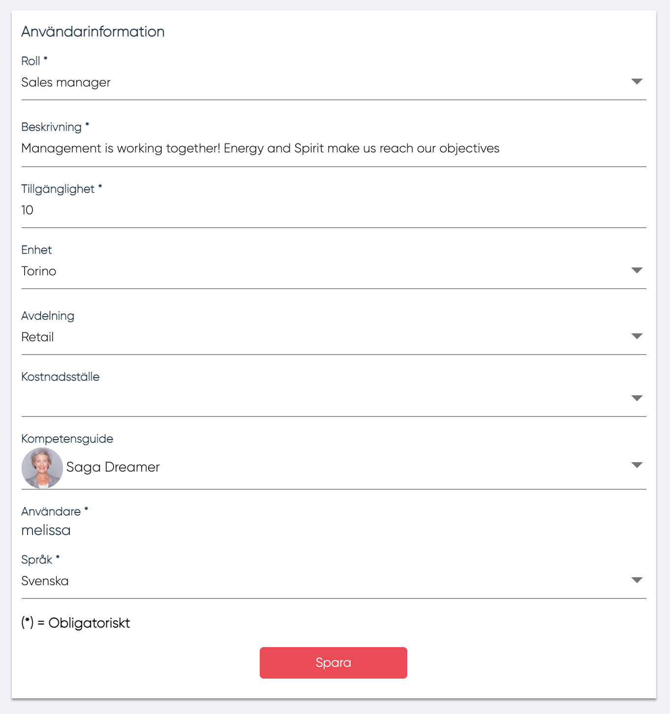
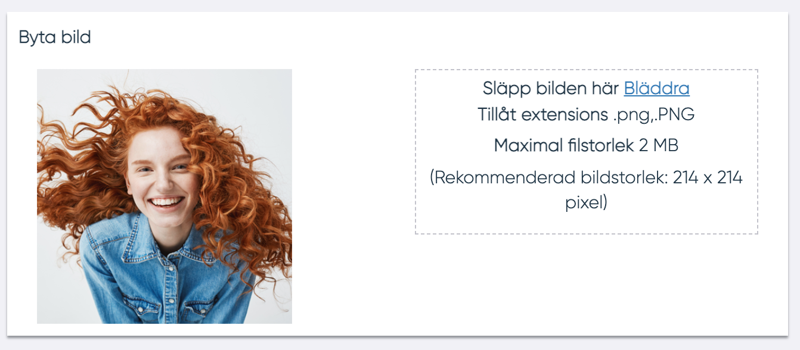
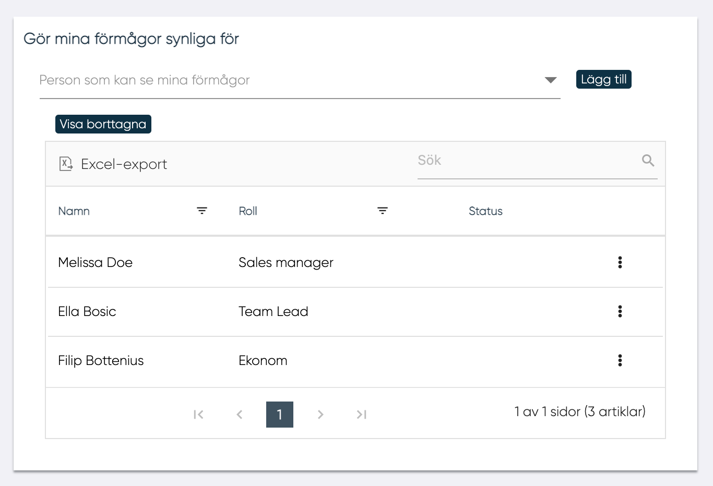

# Användarinformation

Användare kan komma åt sina egna uppgifter från menyn.

<figure markdown>
  {width=300}
</figure>

## Allmän användarinformation

Här kan användare hantera sin användarinformation :

- Roll
- Beskrivning
- Tillgänglighet från 0 till 100 (tillgänglighet i procent)
- Enhet
- Avdelning
- Kostnadsställe
- Kompetensguide
- Byta språk

<figure markdown>
{width=400}
</figure>

## Byta bild

Användaren kan ladda upp sin egen bild. Bilden kommer att visas i användarpanelen och kommer att vara synlig för alla andra användare i samma företag.

## Gör dina förmågor synliga

Med "Gör dina förmågor synliga" kan användaren sina förmågor synliga för andra MPs, ledare och distributörer.

Användaren kan välja användare i rullgardinsmenyn och klicka på "Lägg

I tabellen visas följande:

- Namn
- Roll
- Status
- Rullgardinsmeny.
    - Ta bort person från listan
  

--------
