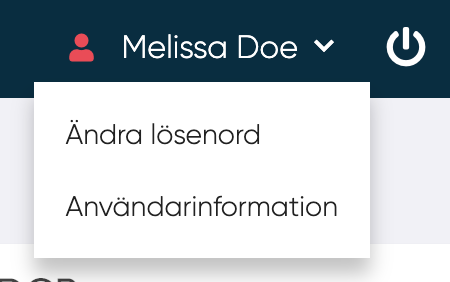

# Användarinformation

Användare kan komma åt sina egna uppgifter från menyn.

<figure markdown>
  {width=400}
</figure>

<!---Fixa ny bild--->

## Allmän användarinformation

Här kan användare hantera sin användarinformation :

- Roll <!--- Tog bort text om skrivskydd : enligt företagskonfigurationen ett av dessa alternativ är närvarande i form: Skrivskyddad, är uppdatering av ERP-gränssnitt som väljs i en rullgardinsmeny, alternativen som finns i rullgardinsmenyn hanteras av administratören i en textruta --->
- Beskrivning
- Tillgänglighet från 0 till 100 (tillgänglighet i procent)
- Enhet
- Avdelning
- Kostnadsställe
- Kompetensguide
- Byta språk

<!--Person som kan väljas i en lista definierad av administratörsanvändare, skrivskyddat språk, här kan MP välja språk för innehållet i applikationen är detta en kompetensguide? -->

<!---Lägg bild brevid text--->
<figure markdown>
{width=400}
</figure>

## Byta bild

Användaren kan ladda upp sin egen bild. Bilden kommer att visas i användarpanelen och kommer att vara synlig för alla andra användare i samma företag. 

## Gör dina förmågor synliga

Med "Gör dina förmågor synliga" kan användaren sina förmågor synliga för andra MPs, ledare och distributörer.

Användaren kan välja användare i rullgardinsmenyn och klicka på "Lägg

I tabellen visas följande:

- Namn
- Roll
- Status
- Rullgardinsmeny.
    - Ta bort person från listan
  
<!--Är det denna strukturen? Har svårt att förstå texten
Ta reda på vad status betyder
Vad ska vi göra med visa borttagna-->

--------
