# Användarpanel

När en användare som inte är ledare för en nod eller DCP loggar in kommer den till sin användarpanel.

Användarpanelen kan också hittas i menyraden.
<figure markdown>
{width=200}
</figure>

En MPs användarpanel innehåller följande:

- MP-data (bild, namn, efternamn, roll, tillgänglighet)
- Kunskaper (använder just nu, använder inte just nu och vill lära mig)
- Kompetensaktiviteter
- Kompetensförmågor (lista och spindeldiagram)
- The Lemon
- Mina noder
- Anslutna DCP: er
- Mottagna DCP: er
- Taggar
- Skriv ut

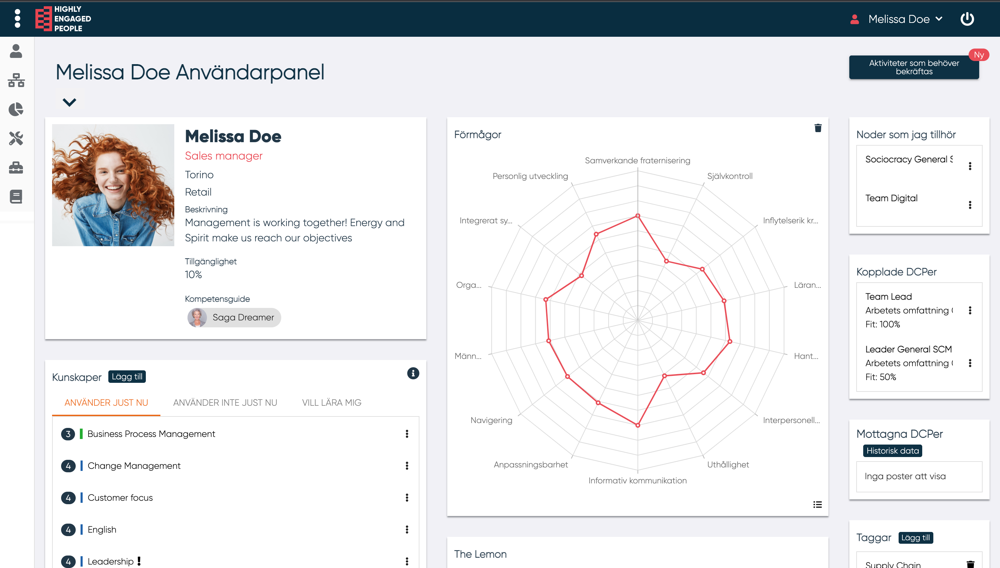{width=650}

<!---Bild över hela användarpanelen om de går--->
-------

## Användardata

Data som finns i detta avsnitt är:

- Namn
- Bild
- Roll
- Enhet
- Kostnadsställ
- MP-beskrivning
- Tillgänglighet
- Kompetensguide

--------

## Kunskaper

I den här sektionen finns det tre olika kategorier av kunskaper:

- Använder just nu
- Använder inte just nu
- Vill lära mig

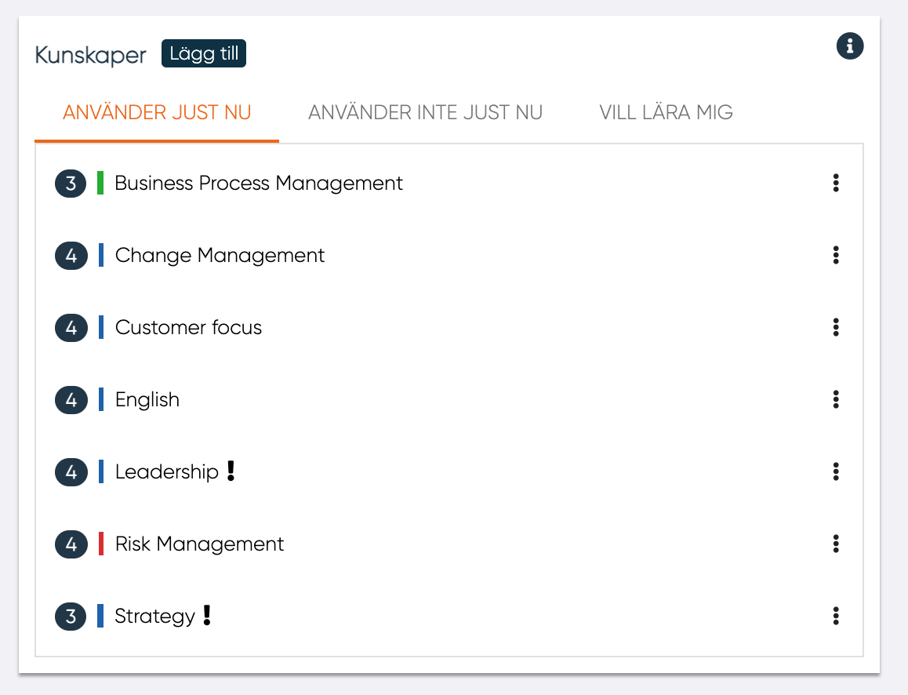

Genom att klicka på de tre prickarna vid en kunskap kan användaren redigera sina kunskaper.

-------

### **Lägg till kunskap**

Genom att trycka på "Lägg till" brevid titeln "Kunskap" kan användaren lägga till en ny kunskap.

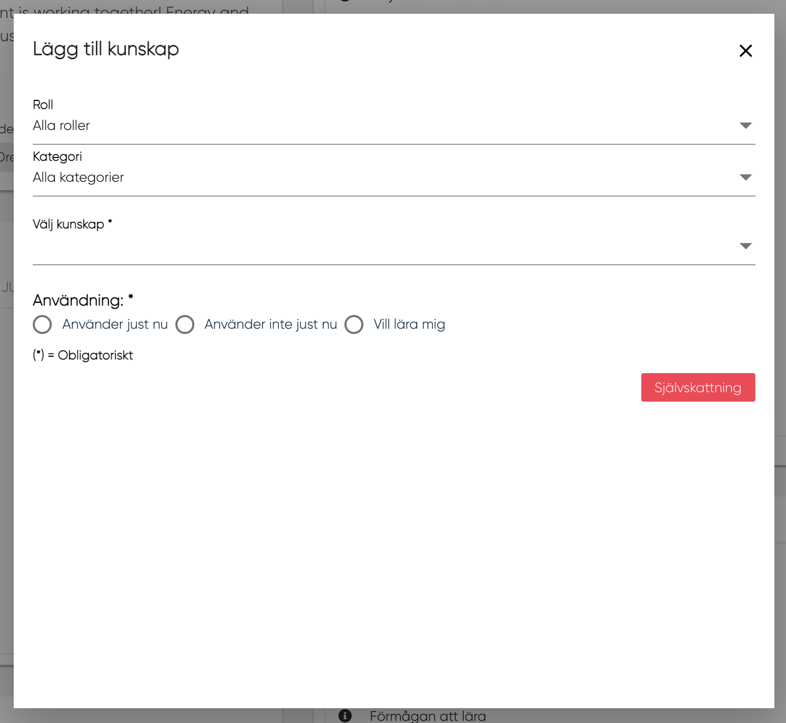

En kunskap kan väljas från en lista av kunskaper eller skrivas in textrutan under "Välj kunskap".

Skrivs en kunskap in som inte finns i listan kommer den att valideras av HR. Dessa kunskaper har i listan en färg och en stil som förklarar dess status:

- Fet stil: För kunskaper som redan är i MPs lista
- Röd: För kunskaper som ska bli validerade av HR
- Fet stil röd: För kunskaper som redan är i MPs lista och som skall bli validerade av HR

När du väl har valt kunskapen är det nödvändigt att definiera i vilken kategori av användning kunskapen ska infogas i:

- Använder just nu
- Använder inte just nu
- Vill lära mig

Klicka på "självskattning" för att ange kunskapsnivån

-------

### **Kalibrering**

Kalibrering gör det möjligt för användaren att verifiera noggrannheten av sin självskattning. 

!!! info
    Självskattningen ändras inte automatiskt efter kalibrering, utan värdet från självskattningen står kvar.

<!---Bilder?--->
Skillnaden mellan kalibrering och självskattningen visas genom en färgad sträck brevid självskattningen.

Följande gäller:

- Blå: Ingen kalibrering utförd.
- Grön: Kalibrering överensstämmer med självskattning.
- Gul: Mindre avvikelse mellan självskattning och kalibrering.
- Röd: Stor avvikelse mellan självskattning och kalibrering.

## Kompetensutvecklingsaktiviteter

I denna sektion kan användaren se:

- Pågående/planerade aktiviteter - Aktiviteter för vilka start- och slutdatum inte passerats eller bekräftats
- Genomförda aktiviteter (Klart) - Aktiviteter för vilka start- och slutdatum passerats och bekräftats

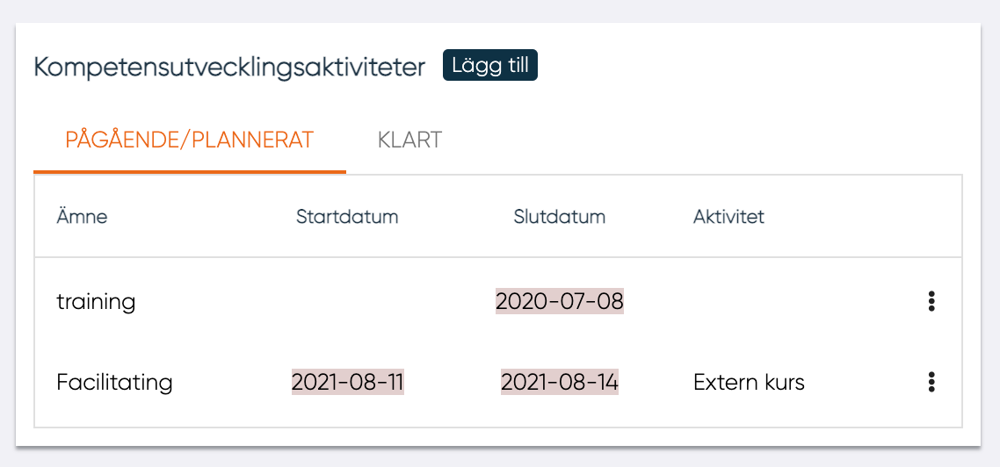

För varje aktivitet gråmarkeras aktiviteten om startdatum eller slutdatum inte har bekräftats.

Användaren kan redigera en aktivitet genom att klicka på de tre punkterna vid en aktivitet. Följande valmöjligheter ges:

- Öppna / redigera aktivitet
- Radera aktivitet
- Bekräfta startdatum och/eller slutdatum

### **Lägg till kompetensutvecklingsaktivitet**

Genom att trycka på "Lägg till" brevid titeln "Kompetensutvecklingsaktiviteter" kan användaren lägga till en ny kompetensutvecklingsaktivitet.

<figure markdown>
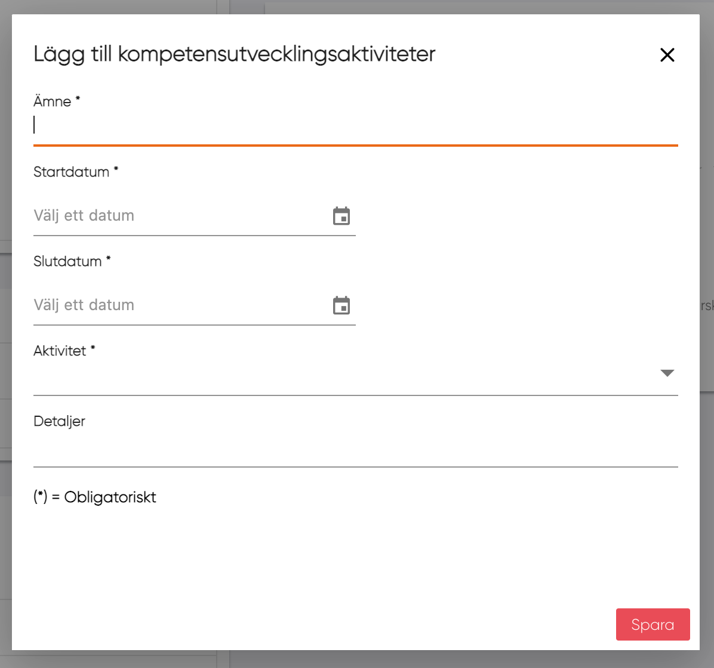{width=500}
</figure>

För att lägga till kompetensutvecklingsaktivitet behövs:

- Ämne
- Startdatum
- Slutdatum
- Aktivitet som väljs från en lista
- Detaljer

Och sen klicka på spara.

## Förmågor

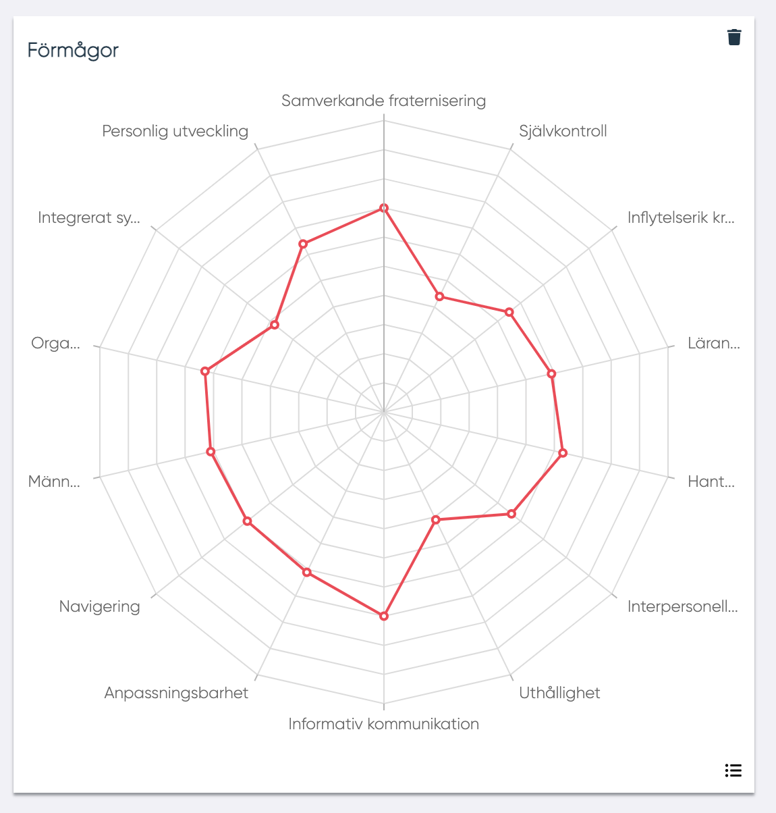

I det här Spindel-diagrammet visas 14 förmågor.
Användare kan göra om sin förmågeprofil var tredje månad genom att klicka på soptunnan i övre höger hörn. Om tre månader inte ha passerats, informeras MP med hjälp av en pop-up:varning om när de kommer att kunna göra bedömningen.

!!! info
    Tidintervallet är konfigurerbart av organisationen och har standardvärdet 3 månader.

För att växla från diagram till lista och tvärtom kan MP klicka på symbolen i nedre höger hörnet.

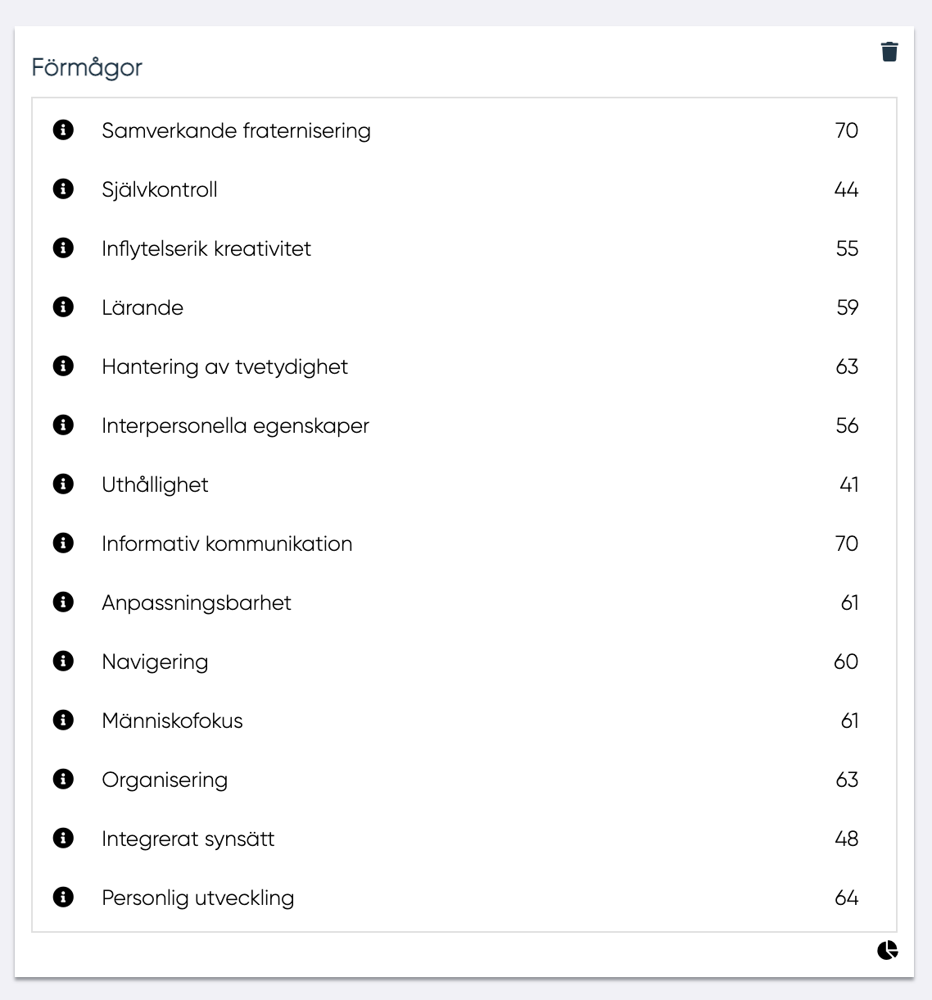

I listvyn kan mer information om förmågan visas genom att trycka på 'i' vid förmågans namn. <!---Bild!--->

## The Lemon

I det här spindeldiagrammet finns 5 områden från "The Lemon" som är kopplade till förmågor. För att växla från diagram till lista och tillbaks kan användaren trycka på ikonen i nedre höger hörn.

I listvyn kan mer information om området visas genom att trycka på 'i' vid områdets namn.

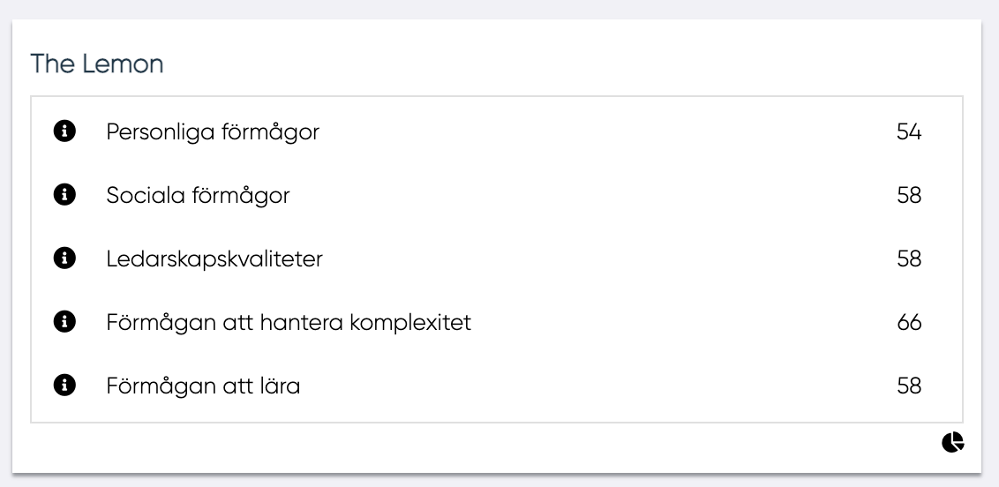

## Noder som jag tillhör

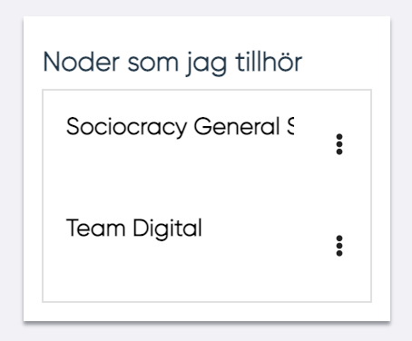

I denna panel visas alla noder som MP är ansluten till. Genom att klicka på "Öppna" i rullgardinsmenyn öppnas en nod med tillhörande DCPer kopplade till noden.

## Kopplade DCPer

I denna panel visas alla DCP:er som en MP är ansluten till. För varje DCP kan MP se namnet för DCPn, arbetets omfattning (i procent) samt Fit-Gap för kunskapsnivå (i procent). I rullgardingmenyn kan MP välja att se fullständig Fit-Gap.

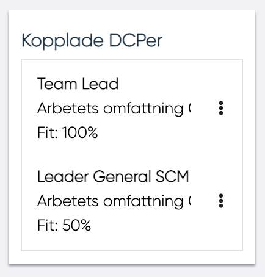

## Mottagna DCPer

<!---Annan bild--->
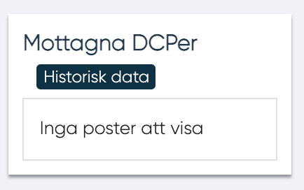

I denna panel kan användaren se alla mottagna DCP:er, i listan finns alla DCP:er som mottagits av användaren och som inte har anslutits till någon annan MP än. MP kan klick på "Historisk data" för att se alla DCP:er som mottagits tidigare.
För varje DCP som finns i listan visas följande information:

- DCP-namn
- DCP-beskrivning
- Ledare som skickade
- Datumet när DCP har skickats

Genom att klicka på Fit-Gap i rullgardinsmeny kan MP se sin egen Fit-Gap.

## Taggar

I denna panel visas MP:s taggar.
Genom att klicka på "Lägg till" kan MP lägga till ny tagg. I listan grupperas taggar efter kategorier.
Genom att klicka på soptunnan tas en tagg bort.

<figure markdown>
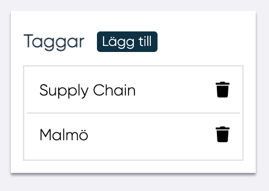{width=300}
</figure>

## Skriv ut

Informationen från användarpanelen kan exporteras till PDF eller Word. Formatet väljs i rullgardinsmenyn vid användarens namn.

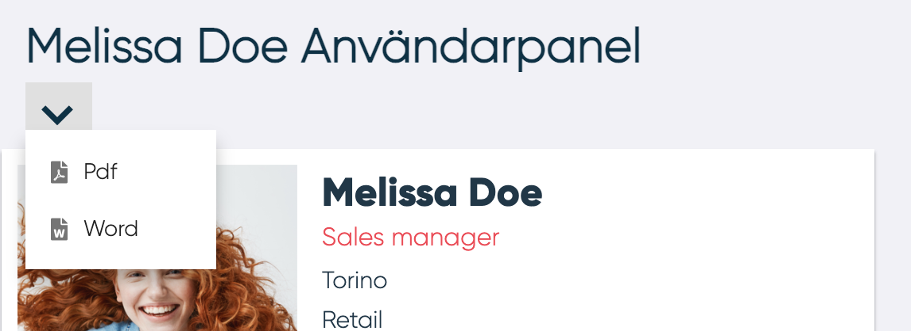

-------
