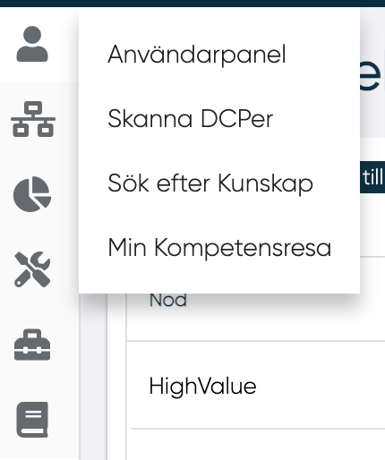
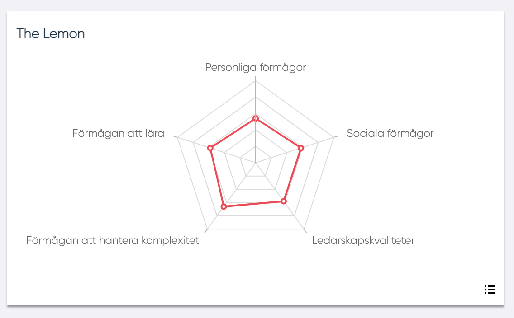
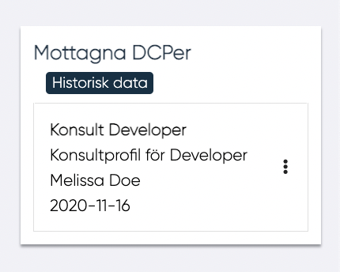

# Användarpanel

När en användare som inte är ledare för en nod eller DCP loggar in omdirigeras användaren till sin "Användarpanel".

Användarpanelen kan också hittas i i den vänstra menyraden.
<figure markdown>
{width=200}
</figure>

En MPs användarpanel innehåller följande:

- MP-data (bild, namn, efternamn, roll, tillgänglighet)
- Kunskaper (använder just nu, använder inte just nu och vill lära mig)
- Kompetensaktiviteter
- Kompetensförmågor (lista och spindeldiagram)
- The Lemon
- Mina noder
- Anslutna DCP: er
- Mottagna DCP: er
- Taggar
- Skriv ut

{width=650}

-------

## Användardata

Data som finns i detta avsnitt är:

- Namn
- Bild
- Roll
- Enhet
- Kostnadsplats
- MP-beskrivning
- Tillgänglighet
- Kompetensguide

--------

## Kunskaper

I den här sektionen finns det tre olika indelningar för kunskaper:

- Använder just nu
- Använder inte just nu
- Vill lära mig

Genom att klicka på de tre prickarna vid en kunskap kan användaren redigera sina kunskaper.

-------

### **Lägg till kunskap**

Genom att trycka på "Lägg till" brevid titeln "Kunskap" kan användaren lägga till en ny kunskap.

En kunskap kan väljas från en lista av kunskaper eller skrivas in textrutan under "Välj kunskap".

Skrivs en kunskap in kan den valideras av HR. Dessa kunskaper har i listan en färg och en stil som förklarar dess status:
Fetstilt: För kunskaper redan valda av MP
Röd: För kunskaper som ska bli validerade av HR Administratör
Fetstilt röd: För kunskaper som redan valts av en MPs kunskaper och som skall bli validerade av HR Administratör.

När du väl har valt kunskapen är det nödvändigt att definiera i vilken kategori kunskapen ska infogas i:

- Använder just nu
- Använder inte just nu
- Vill lära mig

Klicka på Självskattning för att infoga kunskapsnivån

-----

### **Kalibrering**
Kalibrering gör det möjligt för användaren att kontrollera noggrannheten en självskattning.

1. Fylla i
2. Självskattning
3. Ev. kalibrering

<!---Bilder?--->
Skillnaden mellan kunskapsnivåer för kalibrering och självskattningen markeras med hjälp av en färgad stapel till höger om självskattningen.

Följ dessa regler för färg för denna stapel:
Blå: Kalibrering har ännu inte utförts.
Grön: Ingen signifikant skillnad mellan självskattning och systemkalibrering.
Gul: Något signifikant skillnad mellan självskattning och systemkalibrering.
Röd: Signifikant skillnad mellan självskattning och systemkalibrering

## Kompetensutvecklingsaktiviteter

I denna sektion kan användaren se:

- Pågående / planerade aktiviteter - Aktiviteter för vilka start- och slutdatum inte passeras eller bekräftas
- Färdigställda aktiviteter(Klart) - Aktiviteter för vilka start- och slutdatum passeras och bekräftas

För varje aktivitet gråmarkeras aktiviteten om startdatum eller slutdatum inte har bekräftats.

 Användaren kan redigera en aktivitet genom att klicka på de tre punkterna vid en aktivitet. Man ges då valmöjligheten att:
 
 - Öppna / redigera aktivitet
 - Radera aktivitet
 - Bekräfta startdatum och/eller slutdatum

### **Lägg till kompetensutvecklingsaktivitet**

Genom att trycka på "Lägg till" brevid titeln "Kompetensutvecklingsaktiviteter" kan användaren lägga till en ny kompetensutvecklingsaktivitet.
<figure markdown>
{width=500}
</figure>

För att lägga till kompetensutvecklingsaktivitet behövs :

- Ämne
- Startdatum
- Slutdatum
- Aktivitet (rullgardinsmeny)
- Detaljer

Och sen klicka på spara.

## Förmågor

I det här Spindel-diagrammet visas 14 kompetenser.
Användare kan uppdatera eller ompröva sin egen bedömning var tredje månad genom att klicka på soptunnan i övre höger hörn. Om tre månader inte ha passerats, informeras MP med hjälp av en pop-up:varning om när de kommer att kunna göra bedömningen.
För att växla från diagram till lista och tvärtom måste MP klicka på symbolen i nedre höger hörnet.

I listvyn kan mer information om förmågan visas genom att trycka på 'i' vid förmågans namn.

## The Lemon
I det här spindeldiagrammet finns de 5 förmågor från "The Lemon". För att växla från diagram till lista och tillbaks kan användaren trycka på iconen i nedre höger hörn

I listvyn kan mer information om förmågan visas genom att trycka på 'i' vid förmågans namn.

## Noder som jag tillhör

I det här avsnittet visas alla noder på DCP:erna som MP är ansluten till. Genom att klicka på Utvärdera nod i rullgardinsmenyn kan MP se listan över DCP: er som är anslutna till noden och några detaljer om DCP.

Genom att trycka på de tre punkterna vid en nod kan användaren öppna en vy av noden.

## Kopplade DCPer
I denna sektion visas alla DCP:er som en MP är ansluten till. För varje DPC visas:

- DCP-arbetsbefattning
- MPP/DCP fit-gap

Genom att klicka på Fit-Gap i rullgardinsmeny visas MPP/DCP fit-gap.

## Mottagna DCPer

I den här sektionen kan användaren se alla mottagna DCP:er, i listan finns alla DCP:er som mottagits av användaren och som inte har anslutits till någon annan MP än. Medan du klickar på "Historiska data" kan användaren se alla DCP:er som mottagits tidigare.
För varje DPC som finns i listan visas följande information:

- DCP-namn
- DCP-beskrivning
- Ledare som skickade
- DCP-datumet när DCP har skickats
Genom att klicka på Fit-Gap i rullgardinsmeny kan MP se MPP/DCP-fit gap.

## Taggar

I det här avsnittet visas MP:s taggar.
Genom att klicka på Lägg till MP kan du lägga till ny tagg. I listan grupperas taggar efter funktionellt område och plats.
Klicka på soptunnan för att ta bort en tagg

<figure markdown>
{width=300}
</figure>

## Skriv ut

Användarpanelen kan exporteras till PDF- eller Word-format. Detta görs genom att markera pilen vid användarens namn och välja det önskade formatet.

---------------