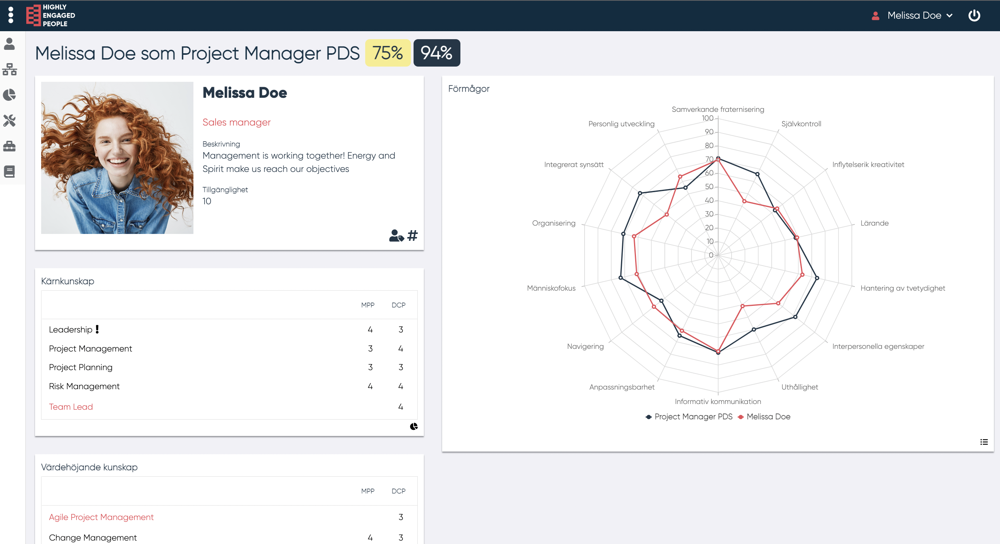

# Fit Gap

<!--- Bild med skilda procent--->

I MPP/DCP-fit gap kan MP se: Fit-gap av alla kärnkunskaper som krävs på DCP (75%) Fit-gap med tanke av endast de kunskaper som finns i MP-profilen bland de grundläggande kunskaper som krävs på DCP (94%) DCP-data:

- Namn på DCP
- Beskrivning av DCP
- Status av DCP
- DCPns arbetsomfattning

En knapp med namn och bild på ledaren som ansvarar för DCPn visas. Knappen kan ha två olika färger. Röd innebär att ledaren inte kan se MPs förmågeprofil och grön att MPs förmågeprofil är synlig för ledaren. MP kan genom att trycka på knappen välja att visa eller inte visa sin förmågeprofil för ledaren.

De kunskaper som är skrivna i röd text är kunskaper som MP inte har i sin profil men är del av DCPn. Om MP har denna kunskap kan denna läggas till genom att klicka på kunskapen, då går man igenom samma steg som när man lägger till en kunskap i ens profil. Efter detta uppdateras fit-gap automatiskt.

--------------------------------------
