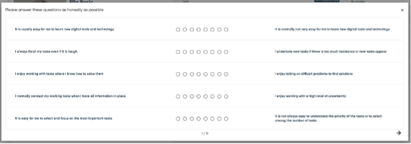
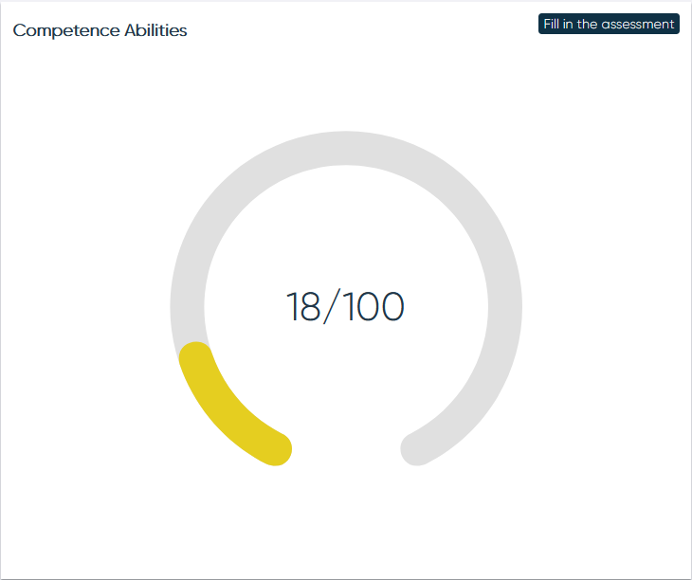

# Förmågeprofil

För att skapa förmågeprofilen fyller MP i ett frågeformulär bestående av 55 motsatspåståenden. För att komma till frågeformuläret trycker MP på "Fyll i uppskattning av förmågor"

I frågeformuläret presenteras fem frågor per sida. För att gå vidare till nästa sida måste MP svara på alla de fem frågorna. När MP har gått till nästa sida är det inte möjligt att återgå till föregående. MP kan välja att fylla i formuläret över flera tillfällen, då visas första obesvarade frågan för tillfälle.

Diagrammet uppdateras sedan för att visa andelen frågor som redan har besvarats.

<figure markdown>
{width=360 align=left}
{width=360 align=right}
</figure>
När alla frågor har besvarats visas förmågeprofilen i ett spindeldiagram samt i en lista.

--------------------------
