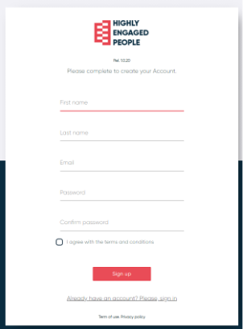

# Registrera dig

{align=left}

En användare kan skapa sin egen användarprofil genom att infoga:

- Förnamn
- Efternamn
- E-postadress
- Lösenord

Genom att klicka på "Registrerings"-knappen skapas en användare de vill säga en MP. Ett mail skickas för att informera om att registreringen har slutförts.

**Denna funktion är inte tillgänglig för tillfället.**

--------------------------------
