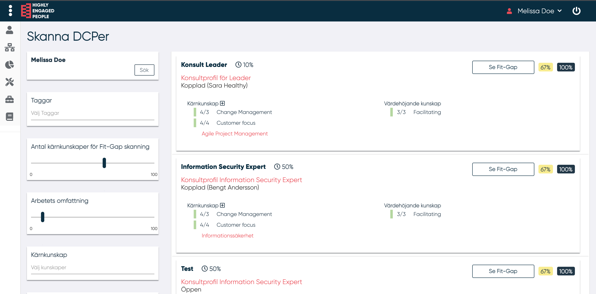

# Skanna DCPer

Med funktionen "Skanna DCPer" kan användare söka efter DCP:er som kan vara relevanta för deras egna kunskaper.

-----

För funktionen kan MP definiera följande filterparametrar:

- Taggar
- Antal kärnkunskaper för fit-gap
- DCP-arbetets omfattning
- Grundläggande kunskaper
- DCP-status

I DCP:erna visas:

- DCP-namn
- Arbetsbefattning
- Beskrivning
- Status och ansluten MP
- Grundläggande kunskaper
- Värdehöjande kunskaper
- Fit-gap med tanke på alla DCP-kunskaper
- Fit-gap med endast DCP-kunskaperna betygsatta av MP

Genom att klicka på "Se fit-gap" visas användarens MPP/DCP fit-gap.

-----
