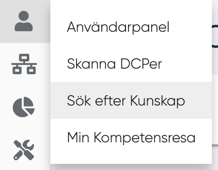
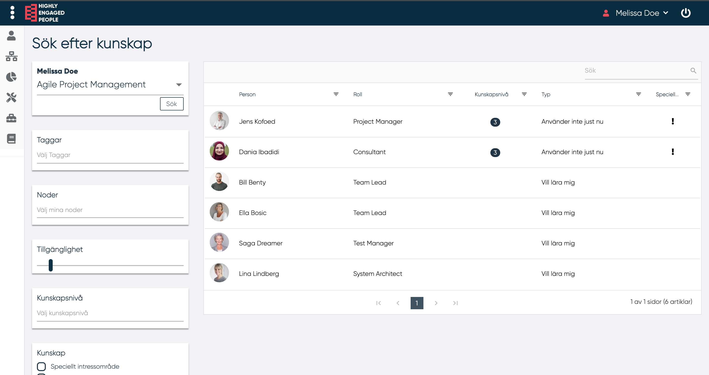

# Sök efter kunskap
<figure markdown>
{width=300}

</figure>

I denna panel kan en användare söka efter MPs med en specifik kunskap.
Användaren kan ställa in följande filterparametrar:

- Kunskap (obligatoriskt)
- Taggar
- Noder (här visas alla noder MP tillhör)
- Tillgängligheten för de MP man söker bland
- Kunskapsnivå
- De MP som har den sökta kunskap som speciellt intresseområde
- De MP som vill lära sig den sökta kunskapen

---------

Genom att klicka på "Sök" visas listan över MPs:

För varje MP i listan visas:

- Bild
- Namn
- Roll
- Kunskapsnivå
- Användningskategori (använder just nu, använder inte just nu eller vill lära mig)
- Speciellt intresseområde

---------
