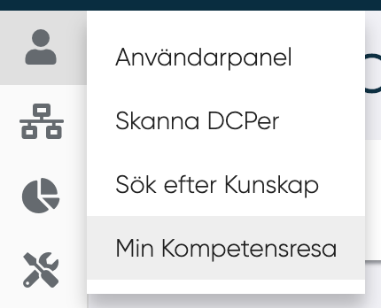

# Sök efter kunskap
<figure markdown>
{width=300}

</figure>

I det här avsnittet kan en användare söka efter MPs med en specifik kunskap.
MP kan ställa in följande filterparametrar:

- Kunskap (obligatoriskt)
- Taggar
- Noder (här visas alla noder i DCP:erna som MP är ansluten till)
- MP-tillgänglighet
- Kunskapsnivå
- Kunskapsintresse
- Kunskap MP vill lära sig

---------

Genom att klicka på Sök visas listan över MPs:

För varje MPs visas följande:

- Bild
- Namn
- Roll
- Kunskapsnivå
- Skriv (används för närvarande inte och vill lära dig)
- Intresserad av kunskapen

-------