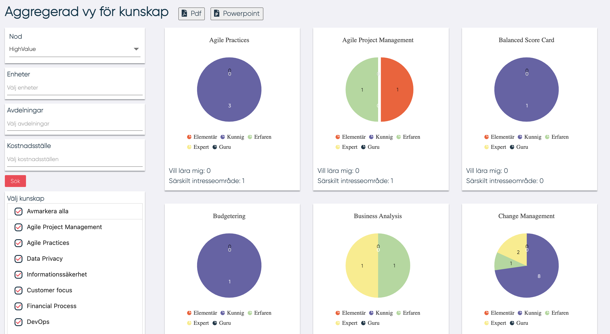

# Aggregerad vy för kunskap

Ledare kan se aggregerad vy för kunskap för de noder som den är ledare för. HR kan se aggregarad vy för kunskap för vilken den har tillgång.

Man öppnar "Aggregerad vy för kunskap" genom att välja tårtdiagrammet i menyn:

<figure markdown>
{width=400}
</figure>

För att se en aggregerad vy av kunskaper väljer användaren en nod. De är möjligt att filtrera på följande:

- Enhet
- Avdelning
- Kostnadsställe

Genom att klicka på "Sök" visas en lista över de kunskaper som finns baserat på de valda sökkriterierna.

I listan kan användaren välja en eller flera kunskaper, den aggregerade datan visas:

Användaren kan också exportera den aggregerade vyn till PDF eller PowerPoint genom att klicka på en av knapparna högst upp på sidan brevid titeln.

I denna statistik betraktas de kunskaper som finns i DCP:er som är anslutna till vald nod och alla DCP:er som är anslutna till alla undernoder.

----------------------
