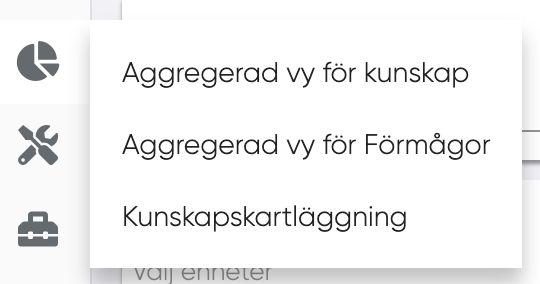
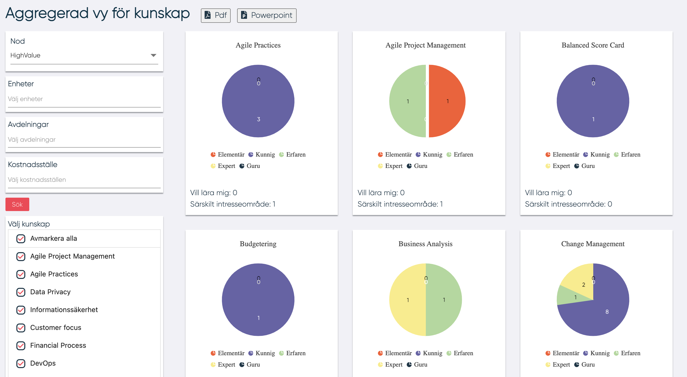

# Aggregerad vy för kunskap

För att navigera till "Aggregerad vy för kunskap" leta efter följande:

<figure markdown>
{width=400}
</figure>
För att skapa en aggregerad vy av kunskaper väljer användaren in en nod och sedan en eller flera av följande:

- Enheter
- Avdelningar
- Kostnadsställen
- Genom att klicka på  sökknappen visas kunskapslistan.

Nu kan användaren välja en eller flera kunskaper, den aggregerade datan visas i grafer likt nedan:

Användaren kan också exportera diagramlistan till PDF eller Power Point genom att klicka på en av knapparna högst upp på sidan brevid titeln.

I denna statistik betraktas de kunskaper som finns i DPC:er som är anslutna till vald nod och alla DPC:er som är anslutna till alla undernoder.

----------------------
