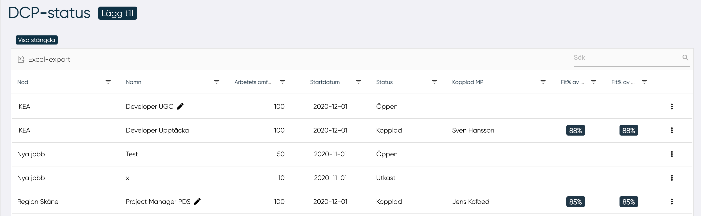
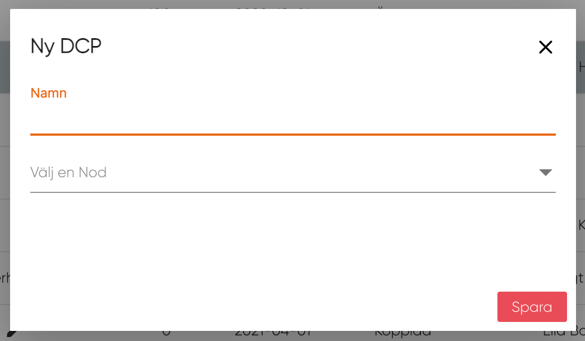

# DCP status

Ledaren kan på DCP-status sidan hantera DCPs, alltså redigera, skapa nya och ta bort dem för akka organisationer där den är ledare.

Genom att klicka på "Lägg till" knapp kan användaren skapa en ny DCP.

I rutnätet visas följande data:

- Nod
- DCP-namn
- Arbetsbörda
- Startdatum
- Status
- Ansluten MP
- Fit-gap med tanke på alla DCP-kunskaper
- Fit-gap med endast DCP-kunskaperna betygsatta av MP

## Skapa ny DCP

<figure markdown>
{width=500}
</figure>
Genom att klicka på knappen "Lägg till" öppnas ett popup-fönster och ledaren måste skriva in all information som behövs för att definiera nästa DCP:

- Namn på DCP
- Nod

Efter detta kommer en ny sida upp med den nya DCP:n, för med information: [Klicka här](ny_dcp.md){ .md-button .md-button--primary}

------------
