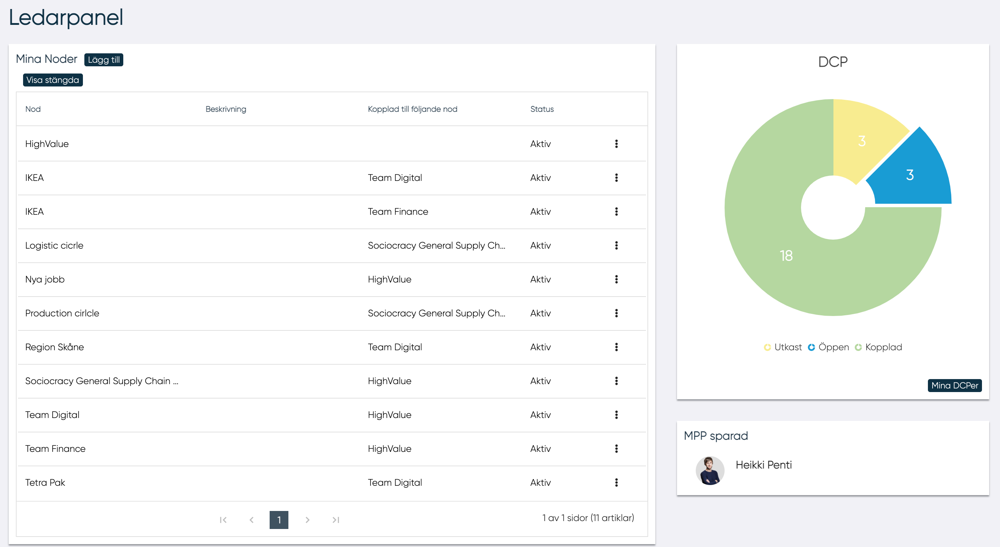
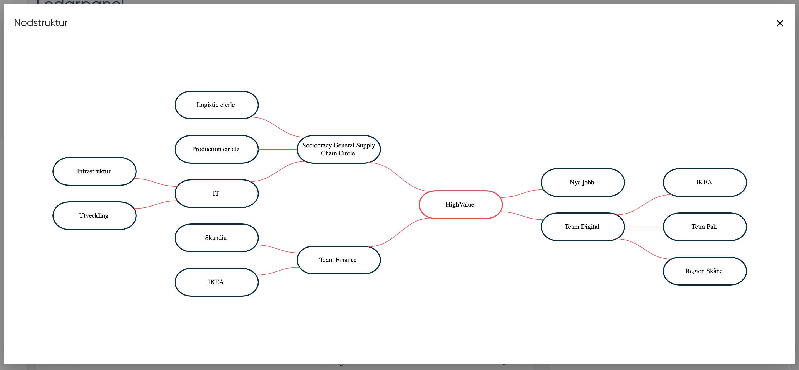

# Ledarpanel

När man loggar in som ledare för en nod eller DCP omdirigeras man till en ledarpanel. I ledarpanelen hittar man huvuddata som:

- Mina noder (endast om användaren är en ledare i minst en nod)
- DCP skickat
- DCP-sammanfattning
- MPP sparad

## Mina noder

Användaren kan under "Mina Noder" se alla noder för vilket användaren har utsetts till ledare.

Varje nod har en status. En nodstatus kan vara utkast, aktiv eller stängd.

När användaren vill stänga en nod är det nödvändigt att alla undernoder kopplat till noden stängs och alla MP:s kopplas ifrån noden.

För att redigera en nod, tryck på de tre prickarna vid nodens namn och sedan på "redigera".

För mer information om hur man redigerar en nod: [Klicka här](edit_node.md){ .md-button .md-button--primary}

För att öppna och få mer utförlig information om en nod så kan man trycka på "Öppna" istället för redigera. För mer information om noder: [Klicka här](node.md){ .md-button .md-button--primary}

### ***Visa organisationsstruktur***

Med den här funktionen kan användaren se den grafiska nodstrukturen från vald nod. Följande exempel visar konsultföretaget: HighValue med olika team och för Team Digital och Team Finance också deras kundteam. Den valda noden har en röd kant.

### ***Skapa nya noder***
<!---Skall detta kanske ligga under redigera nod? eller egen--->
Genom att klicka på knappen "Lägg till" öppnas ett popup-fönster och ledaren kan skriva in all information som behövs för att definiera nästa nod, så som:

- Beskrivning av nod
- Föräldranod

Genom att klicka på knappen "Spara" skapas den nya noden och användaren omdirigeras till nodformuläret som innehåller nodens:

- Noddata
    - Namn
    - Status (utkast, aktiv och stängd) 
    - Tid
    - Slutdatum (inaktiverat om tiden är permanent)
    - Föräldranod
    - Ledare
- Kulturdata
- Kompetensegenskaper

Kultur och egenskaper ärvs av föräldranoden.

## DCP skickad

I det här avsnittet listas de DCP:er som skickas ut av en ledare/distributör.
Data är tillgängliga i den här listan tills en ny MP är ansluten till DCP.
I rutnätet finns följande data:

- DCP-namn
- MP-namn och efternamn
- DCP-skickat datum
- Status kan accepteras (v), avvisas (x) eller tömmas. På musen över statusdatum visas.

I rutnätet grupperas MP efter DPC

## Mina DCPs

I avsnittet "Mina DCPs" finns ett cirkeldiagram som sammanfattar statusen där användaren är ledare eller distributör.
Genom att klicka på knappen "Mina DCPs" kan användaren se listan över alla sina DCPs.

För mer information om DCP-status: [DCP-status](DCP-status.md){ .md-button .md-button--primary}

## MPP sparad
<!---Svårtolkad text--->
I det här avsnittet kan ledare/distributören se MPP som är sparade.
Ledare kan spara en MPP i Scan MPPs genom att klicka på bokmärkesikonen nedan.

-------------------------------
