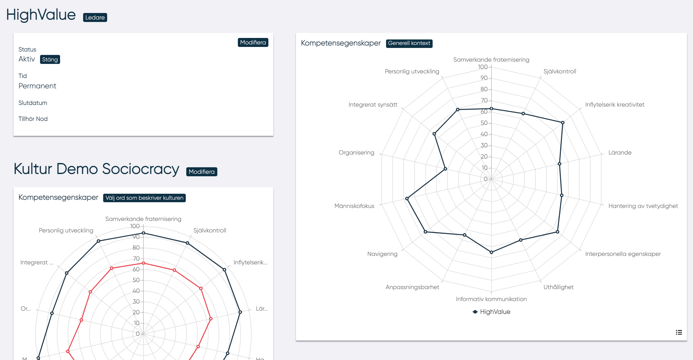

# Redigera nod

## Ledare

Genom att klicka på knappen "Ledare" öppnas ett popup-formulär, där det är möjligt att hantera Ledare.
Ledare kan väljas från en rullgardinsmeny.
Ledaren kan inte avsätta sig själv som ledare.

## Kultur

Genom att klicka på knappen "Välj ord som beskriver kulturen" kan ledaren definiera kulturen genom att välja 20 ord så beräknar algoritmen kulturparametrarna och de 14 egenskaperna för kultur.

<!---kanske inte borde stå varning på engelska--->
!!! warning
    Genom att ändra kulturparametrarna kommer den tidigare kulturinställningen att raderas.

## Kompetensegenskaper

Genom att klicka "Generell kontext" kan en ledare ställa in nodens kontext.

--------------------------
