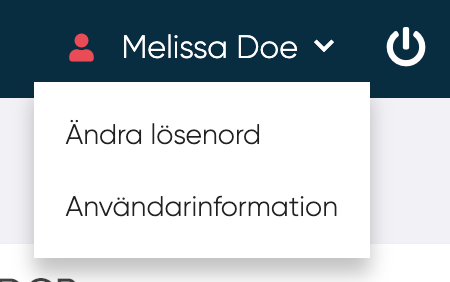
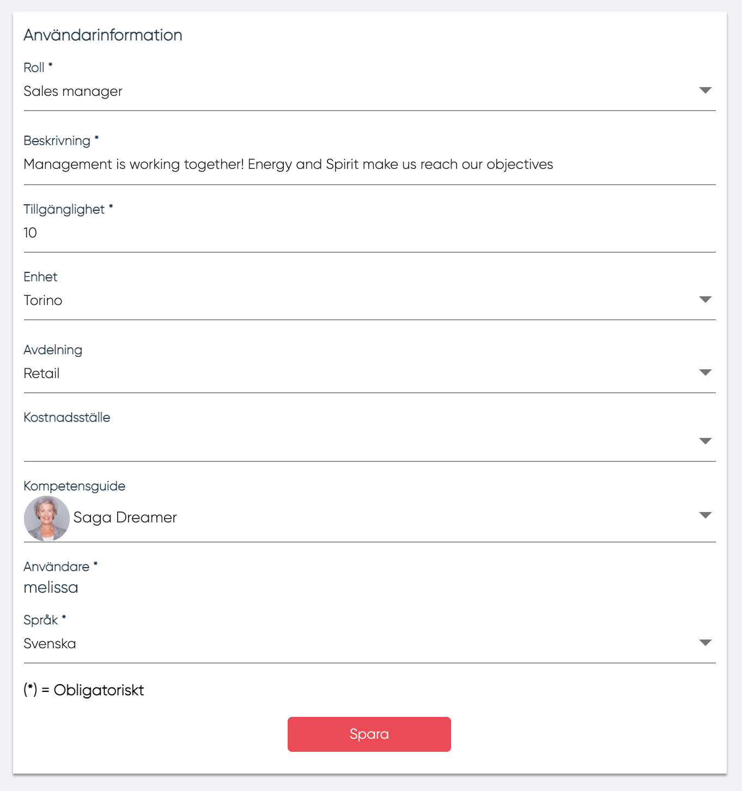
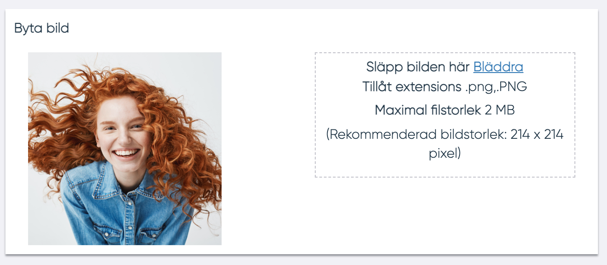
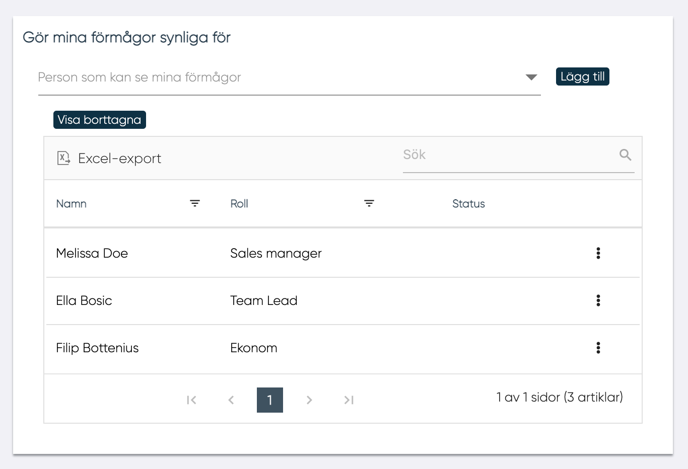

# Användarinformation

Användare kan komma åt sina egna uppgifter från menyn i applikationens övre högra hörn genom att trycka på pilen. 

<figure markdown>
  {width=400}
</figure>

## Allmän användarinformation

Här kan användare hantera sin användarinformation : 

- Roll <!--- Tog bort text om skrivskydd : enligt företagskonfigurationen ett av dessa alternativ är närvarande i form: Skrivskyddad, är uppdatering av ERP-gränssnitt som väljs i en rullgardinsmeny, alternativen som finns i rullgardinsmenyn hanteras av administratören i en textruta --->
- Beskrivning
- Tillgänglighet 
- Från 0 till 100 (tillgänglighet i procent)
- Enhetsavdelning 
- Kostnadscenter 
- Kompetensguide 

<!--Person som kan väljas i en lista definierad av administratörsanvändare, skrivskyddat språk, här kan MP välja språk för innehållet i applikationen är detta en kompetensguide? -->

<figure markdown>
{width=400}
</figure>

## Byta bild

Användaren kan ladda upp sin egen bild. Bilden kommer att visas i användarpanelen och kommer att vara synlig för alla andra användare i samma företag. 

## Gör dina kompetenser synliga

Med "Gör dina kompetenser synliga" kan användaren sina kompetenser synliga för andra MPs, ledare och distributörer.   

Användaren kan välja användare i rullgardinsmenyn och klicka på "Lägg till"-knappen. I rutnätet visas följande:

- Namn 
- Roll 
- Status, är närvarande om personen avbryts 
- Rullgardinsmeny. 
    - Ta bort, om personen är aktiv.  
    - Återaktivera, om personen avbryts
<!--Är det denna strukturen? Har svårt att förstå texten-->

--------
