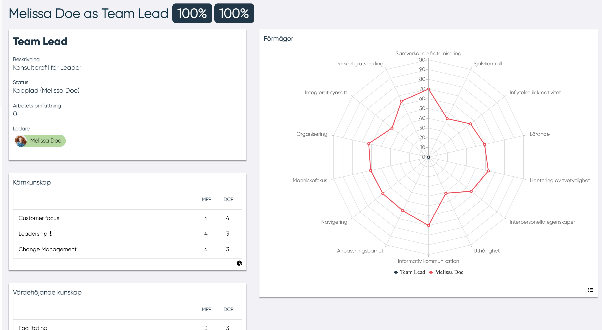

# Fit Gap

I MPP / DCP-fit gap kan MP se: Fit-gap  av alla kärnkunskaper som krävs på DCP (70%) Fit-gap med tanke av endast de kunskaper som finns i MP-profilen bland de grundläggande kunskaper som krävs på DCP ( 88%) DCP-data:

- Namn
- Beskrivning
- Status
- Arbetsbefattning

Ledare (om etiketten är röd får inte Ledare se MP-kompetensförmågor, om etiketten är grön  får ledare se MP-kompetensförmåga). För att aktivera eller inaktivera Ledaren för att se MP-kompetensförmåga måste användare klicka på Ledar-namnet.

DCP Kärn kunskaper, DCP värde höjande kunskap konkurrerar förmågor (diagram och lista). Här kan MP se kompetensförmågan mellan DCP och MP.

--------------------------------------

I MPP / DCP fit gap kan MP se: 
Fit-gap med åtanke av alla kärn kunskaper som krävs på DCP (39%) Fit-gap med åtanke av endast kunskaper som finns vid MP-profilen bland kärnkunskapen från DCP (58%)
DCP Data:

- Namn
- Beskrivning
- Status
- Arbetsbefattning

Ledare (om etiketten är röd Ledare får inte se MP-kompetensförmåga, om etiketten är grön får Ledare se MP-kompetensförmåga). För att aktivera eller inaktivera ledaren för att se MP-kompetensförmåga måste användare klicka på Ledar-namnet.

- Knapp för att acceptera eller avvisa DCP
- DCP kärn-kunskaper
- DCP värdehöjande kunskap

Kompetensförmåga (diagram och lista). Här kan MP se kompetensförmågor mellan DCP och MP. 
Röda kunskaper är de som finns i DCP, men inte betygsatta av MP. För att betygsätta kunskapen måste MP klicka på kunskapen och popupen för att betygsätta kunskapen öppnas.

När MP betygsätter en oklassificerad kunskap uppdateras fit-gap automatiskt. 
Genom att klicka på Jag är intresserad av DCP eller Nej tack. Informeras ledare om MP är intresserade eller inte i DCP inbjudan. Ett mail skickas till Ledaren när du klickar på knappen.

--------------------------------------

I det här avsnittet kan ledare/distributörer se Fit-Gap mellan MPP och DCP.
Det finns:

- Fit-gap med tanke på alla DCP-kunskaper
- Fit-gap med endast DCP-kunskaperna betygsatta av MP
- MP-dataavsnitt, här kan användaren också ansluta eller koppla bort MP från DCP genom att klicka på Anslut / Koppla bort "MP" från DCP-knappen  
- MP-kunskap, genom att klicka på   användaren kan se alla MP-kunskaper
- MP-taggar, genom att klicka på   användaren kan se alla MP-taggar
- DCP vs MPP kärn och värdehöjande- kunskap, diagram och lista. För att växla från diagram till lista och vice versa måste användaren klicka på   och   ikonen.
- MPP kompetens förmågor vs DCP Egenskaper, diagram och lista. MPP Kompetensförmågor är endast synliga om MP har gjort det möjligt för användaren att se egna kompetensförmågor.
Om användaren inte är aktiverad visas det här meddelandet.

För att växla från diagram till lista och vice versa måste användaren klicka på   och  ikonen.
När listan visas kan du se genom att klicka på   Kompetensegenskaper.

---------------------